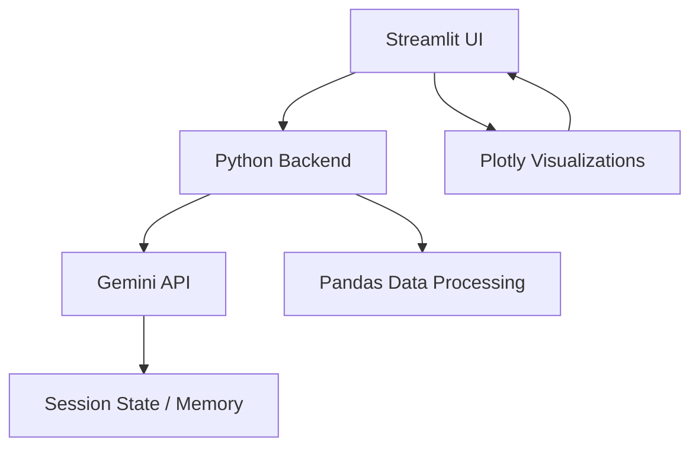

# 🤖 AI Data Analytics Platform

[](https://www.python.org/downloads/)
[](https://streamlit.io)
[](https://ai.google.dev/)
[](LICENSE)

A simple platform for exploring business data with **AI queries**, **interactive dashboards**, and **visualizations**.  
The goal was to combine **Streamlit**, **Gemini AI**, and **Plotly** into something close to a lightweight BI tool.

---

## 🚀 Features

- **AI-powered Q&A**: Ask plain-English questions about your data (via Gemini API).
- **Predefined analysis functions**: Revenue, trends, regional performance, etc.
- **Data intelligence dashboard**: Quick stats like record count, memory usage, data quality.
- **Charts**: Bar, scatter, surface, heatmap, box, violin (all interactive).
- **Sample data generator**: 1.5k–2.5k fake business records for demo.
- **Export**: Save analysis results/reports as markdown.
- **UI**: Streamlit with some custom styling (metric cards, responsive layout).

---

## 🛠 Setup

### Quick Start
```bash
git clone https://github.com/Lokeshraj2006/AI-Powered-Data-Analytics-Platform.git
cd AI-Powered-Data-Analytics-Platform

python -m venv venv
source venv/bin/activate   # Windows: venv\Scripts\activate
pip install -r requirements.txt
```

### API Key
1. Get a Gemini API key from [Google AI Studio](https://aistudio.google.com/).  
2. Copy `.env.example` → `.env`  
3. Add your key:  
   ```
   GEMINI_API_KEY=your_key_here
   ```

### Run
```bash
streamlit run app.py
# Open http://localhost:8501
```

---

## 📖 How to Use

- **Upload data**: CSV, Excel, JSON, Parquet supported.  
- **Or load sample dataset**: Generates realistic business-style data.  
- **Check dashboard**: Total rows, memory, quality %, quick KPIs.  
- **Ask AI**: “Which region has the best sales?”, “Show me quarterly trends” etc.  
- **Charts tab**: Pick X/Y axes, choose chart type, get interactive Plotly graphs.  
- **Business insights tab**: Prebuilt KPIs like revenue, customer satisfaction, regional breakdowns.  
- **Export**: Save reports with timestamps.

---

## 📈 Architecture



---

## ⚡ Tech Stack

| Component        | Tech                  |
|------------------|-----------------------|
| Frontend         | Streamlit + CSS       |
| Processing       | Pandas, NumPy         |
| AI               | Gemini 2.5 Flash      |
| Visualization    | Plotly                |
| Config           | dotenv                |
| File Support     | openpyxl, xlrd, etc.  |

---

## 📊 Example Use Cases

- Business dashboards (sales, KPIs, customer satisfaction)  
- Quick exploratory analysis of new datasets  
- Teaching analytics concepts with an interactive tool  
- Generating visuals/reports fast without writing code  

---

## ⚠️ Limitations and Notes
---
When the app shows a message like "Generated 1,609 random records with 20 fields", you might notice that only a small subset of rows and columns (e.g., around 9) appears in the data preview or even in the exported files. This happens due to:

Incomplete AI-generated data: The AI may sometimes return incomplete or truncated JSON data due to token length limits or other API constraints.

Fallback Dataset: When AI-generated data is insufficient, the app falls back on a timestamp-based random dataset generator that creates smaller or limited samples.

Display and Export Limitations: UI previews often show truncated views for performance reasons. Ensure you check logs or print statements to confirm actual dataset size.

JSON Parsing and Export: Partial or malformed JSON from AI responses can result in smaller DataFrames. The export feature saves what is currently loaded, so if the DataFrame is small, exports will also be small.

---

## 🏗 Project Layout

```
AI-Powered-Data-Analytics-Platform/
├── app.py              # Main Streamlit app
├── setup_project.py    # Optional auto-setup script
├── requirements.txt
├── .env.example
├── README.md
└── src/                # Source code modules
```

---

## 📄 License

MIT License (see [LICENSE](LICENSE))  

---
**🎯 Ready to transform your data analytics workflow?**

⭐ **Star this repository** to show your support!  
🍴 **Fork it** to customize for your needs!  
📢 **Share it** with your network!

**Built with ❤️ for the data community by [Lokeshraj](https://github.com/Lokeshraj2006)**

*Transform your business data into intelligent insights with the power of AI* 🚀

---
This isn’t a polished “enterprise product” — it’s a **working demo / starter BI app** that you can extend for your own data workflows.
